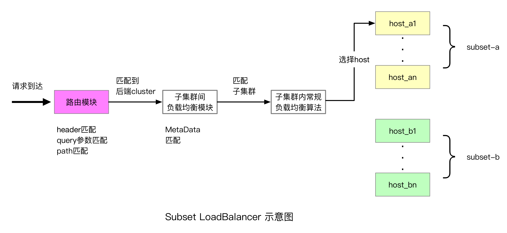

# SubSet LoadBalancer 开发文档

本文档描述的是 SubSet LoadBalancer 的工作流程及功能模块划分。

## Subset lb整体流程

Subset load balancer 用于在 cluster 内部根据 metadata 做子集群匹配，在路由匹配到 cluster 成功之后，再挑选具体的子集群。

下面是带有 Subset LB 功能的 MOSN 工作流程图：


## 功能实现模块划分

Subset LoadBalancer 由以下的功能模块组成。

###  RDS 路由模块

- router 需要根据配置中的 metadata 生成 metadata match criteria，match criteria（匹配参数) 由许多组 key 和 value 组成，且按照 key 进行字典排序，value 为 md5 后的 hash 值，实现函数是 `NewMetadataMatchCriteriaImpl`
- 挑选 host 的时候，需要将 router 的 metadata match criteria 作为上下文传递下去，上下文的定义: `LoadBalancerContext`
- 其中，`activestream` 实现了 `LoadBalancerContext` ，在建立连接池的时候，作为 ctx 传递下去

###  CDS/EDS 后端生成模块

- cluster 根据配置，生成 cluster lb subset 相关信息，包括，生成字典序的 `subset selectors` 以及`default subset` 等，实现函数：`NewLBSubsetInfo`
- `lbsubsetinfo` 根据配置中 `subsetselectors` 是否为空，决定 subset lb 是否开启，在开启时，创建`subset loadbalancer`
- 后端 cluster 基于 host 的 metadata 生成字典树形式存储的 subset 

##  类与接口

- 实现类 `subSetLoadBalancer`，关键成员：`fallbackSubset` 作为兜底选择的子集群，`subSets` 为保存的字典树结构存储的子集群，其中 `fallbacksubset` 的生成函数：`UpdateFallbackSubset`
- subset 的生成函数：`ProcessSubsets/FindOrCreateSubset`
- subset 的查询函数：`FindSubset`
- 存储 subset中 hosts 的类：`PrioritySubsetImpl`

## 关键数据结构

**字典树的 root 节点**

```go
// key: 第一个匹配 key
// value：用于指向
type LbSubsetMap map[string]ValueSubsetMap
```

**中间节点**
```go
//  hashvalue 为索引值 
type ValueSubsetMap map[HashedValue]LBSubsetEntry
```

**索引节点**
```go
// children 指向下一个 ValueSubsetMap，为空的话表示是叶子节点
// prioritySubset 为满足当前 metadata 的子集群，在 LBSubsetEntry 为叶子节点时指向具体的子集群
type LBSubsetEntry struct {
	children       types.LbSubsetMap
	prioritySubset types.PrioritySubset
}
```

**其他**

- pair 类型来存储 key 
- value 值

```go
type SubsetMetadata []Pair
  
type Pair struct {
	T1 string
	T2 HashedValue
}
```

成员为 `string` 的有序的 set
```go
// realize a sorted string set
type SortedStringSetType struct {
   keys []string
}
```